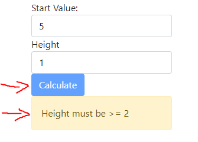
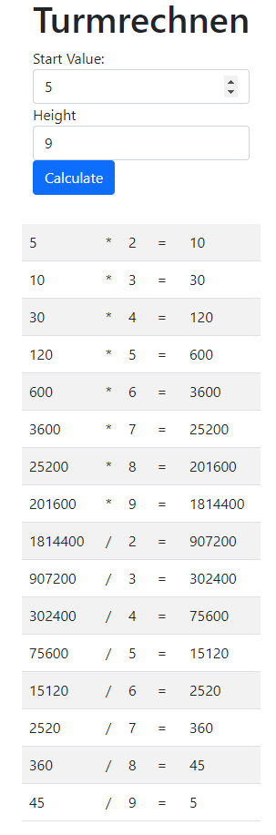

= Turmrechnen

In this exercise you will create a simple Angular application for performing the http://www.floriangeier.at/schule/kopf/kopf.php[Turmrechnen] maths exercise.

== User Input

The user will be asked to enter two pieces of information (configuration):

. The starting value
. The height of the tower

Make sure that no height lower than 2 is used -- if it is, disable the button for the calculation and display an error message like so:

_Hint_: you might need to import the `FormsModule`.

== Calculation

You can implement the calculation and creation of the 'lines' within the default `app.component.ts` (no need for additional components at this point).

The `strict` mode is enabled, so you'll have to make sure your implementation is solid (otherwise you'll get compile errors).

The result should look somewhat like this:

== Requirements

* Make sure your implementation is correct (duh)
** You do not _need_ to write tests this time, but of course you are allowed to if you want
* Ensure that the linter is happy as well
* Commit often -- submissions with less than three commits will *not be graded*!
** Also include your last name at the beginning of every commit message
* Design of the website is not really important
** But do _not_ perform manual DOM manipulation -- bindings only!
